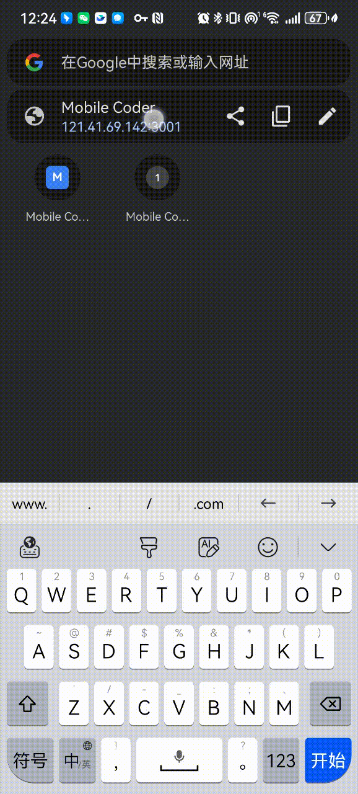

# Mobile Coder

移动端远程控制 Claude Code。



## 新手入门

如果是第一次使用，请阅读 [用户使用手册](./docs/user-manual.md)，包含从零开始的完整教程。

## 功能特点

- **移动端控制**：在手机/平板上远程控制 Claude Code
- **无需登录**：扫码即可连接，简单便捷
- **实时同步**：终端输出在 Desktop Agent 和 H5 之间实时同步
- **快捷键支持**：常用命令和快捷键快速输入
- **多端观看**：支持多个 H5 页面同时观看同一设备

## 架构

```
┌─────────────────┐     WebSocket      ┌─────────────────┐
│  Desktop Agent  │ ◄────────────────► │   Cloud Server  │
│  (tmux + Claude)│                    │   (Go + WS)    │
└─────────────────┘                    └────────┬────────┘
                                                │
                                         WebSocket
                                                │
                                        ┌────────▼────────┐
                                        │   H5 Mobile   │
                                        │  (Next.js)    │
                                        └─────────────────┘
```

## 快速开始

### 前置要求

- [Claude Code](https://github.com/anthropics/claude-code) 已安装
- [Go](https://go.dev/) 1.21+
- [Node.js](https://nodejs.org/) 18+

### 1. 启动 Cloud Server

```bash
cd cloud

# 配置 Supabase（可选，需要 Supabase 项目）
export SUPABASE_PROJECT_URL="your-supabase-url"
export SUPABASE_API_KEY="your-supabase-api-key"

# 编译并运行
go build -o bin/server ./cmd/server
./bin/server
```

### 2. 启动 Desktop Agent

```bash
cd agent
go build -o bin/client ./cmd/client

# 连接本地服务器
./bin/client -server localhost:8080

# 或连接远程服务器
./bin/client -server 192.168.1.100:8080
```

### 3. 访问 H5 界面

- 桌面端：打开 http://localhost:3001
- 移动端：打开 http://<电脑IP>:3001（需要网络可达）

### 4. 绑定设备

1. Desktop Agent 启动后会显示一个 6 位绑定码
2. 在 H5 页面输入绑定码
3. 绑定成功后即可开始控制 Claude Code

## 使用说明

### 文本输入

在输入框中输入命令，点击"发送"按钮或按回车发送。

### 快捷键

点击"快捷"按钮切换到快捷键模式：

- **常用命令**：/help, /clear, /model, /memory
- **执行控制**：Esc, Enter, Ctrl+C, Ctrl+L
- **补全与历史**：Tab, Shift+Tab, ↑, ↓

## 技术栈

- **Cloud Server**: Go, Gorilla WebSocket, Supabase
- **Desktop Agent**: Go, tmux, WebSocket
- **H5 Frontend**: Next.js, Tailwind CSS, TypeScript

## 项目结构

```
agent/          # Desktop Agent 客户端
  cmd/client/   # 客户端主程序
chat/           # H5 前端 (Next.js)
cloud/          # 云服务端 (Go)
```

## Agent 端部署

### 方式一：使用预编译二进制（推荐）

1. **安装依赖**
   ```bash
   # 安装 tmux（必须）
   brew install tmux

   # 确保 claude 命令可用
   which claude
   ```

2. **复制二进制文件**
   - 从本项目的 Releases 或 build 目录获取 `agent/bin/client`
   - 复制到目标 Mac 的任意目录

3. **运行**
   ```bash
   # 连接本地服务器
   ./bin/client -server localhost:8080

   # 或连接远程服务器（替换为服务端IP）
   ./bin/client -server 192.168.1.100:8080
   ```

### 方式二：自行编译

```bash
cd agent
go build -o bin/client ./cmd/client

# 运行
./bin/client -server <服务端IP>:8080
```

### Agent 依赖

- **tmux** - 必须安装
- **Claude Code** - 必须安装（`claude` 命令可用）
- **Go** - 仅在自行编译时需要

## 常见问题

**Q: 手机无法连接到服务器？**
A: 确保手机能访问到服务器所在的网络，使用电脑的 IP 地址访问。

**Q: Desktop Agent 重启后需要重新绑定？**
A: 是的，每次 Desktop Agent 重启都会生成新的绑定码。

**Q: H5 刷新后需要重新绑定？**
A: 不需要，绑定信息保存在 localStorage 中，刷新页面会自动重连。

## License

MIT
